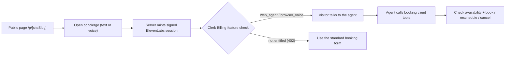
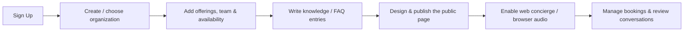
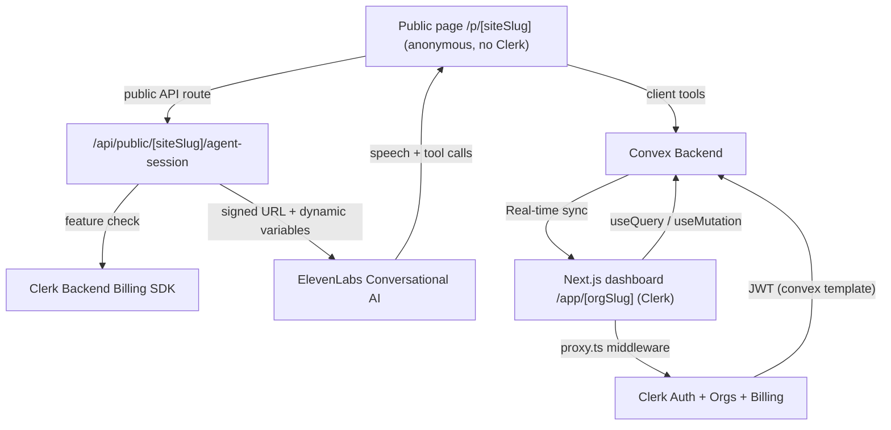

# Oneboard — AI Receptionist & Front-Desk SaaS (ElevenLabs Voice Agents)

[](https://nextjs.org/)
[](https://convex.dev/referral/SONNYS4371)
[](https://go.clerk.com/IVUd0XO)
[](https://elevenlabs.io/)
[](https://tailwindcss.com/)
[](https://www.typescriptlang.org/)

> **⚠️ Disclaimer:** This is an **educational project** built live on YouTube for learning purposes only. "Oneboard" is a fictional name used for this demo — we do not claim any trademark or intellectual property rights over it. This project is **not affiliated with, endorsed by, or connected to** any real receptionist, scheduling, or customer-support company. All organization names, offerings, bookings, contacts, and seed data are entirely fictional. Third-party service names (Clerk, Convex, ElevenLabs, Vercel, Next.js, Tailwind CSS, etc.) are trademarks of their respective owners and are used here solely to describe the technologies used in this project.

A full-stack, real-time **AI front-desk / receptionist SaaS** — a B2B multi-tenant app where any appointment-based business (barber shop, salon, clinic, consultancy, support team) gets a **branded public booking page** with a built-in **ElevenLabs voice + text concierge** that answers questions and **books, reschedules, and cancels appointments** in a live conversation, while staff manage everything from a **tenant-scoped dashboard**.

> **Who is this for?**
> Anyone who wants to learn how to build a production-grade, multi-tenant B2B SaaS with **real-time conversational voice AI**, appointment scheduling, and billing using modern tools — or anyone looking for a serious starter template for their own AI receptionist product.

> **What makes it different?**
> The concierge isn't a text chatbot bolted on — it's a real **ElevenLabs Conversational AI agent** that speaks and listens in the browser, calls your booking tools live, and confirms real appointments. One **shared agent** serves every tenant, injected with each organization's own offerings, team, hours, terminology, and knowledge at session time. Auth, organizations, **and** billing are handled entirely by **Clerk** — no Stripe wiring, no billing webhook, no local subscription mirror. The backend is powered by **Convex** — a reactive database that pushes changes to every connected client instantly.

> **Under the hood**
> Next.js 16 App Router · React 19 · Convex reactive backend · Clerk auth + organizations + B2B billing · ElevenLabs Conversational AI (text + browser audio) · ElevenLabs Agents CLI (versioned agent config) · shadcn/ui + Radix · Tailwind CSS v4 · TypeScript strict mode

---

## 👇🏼 DO THIS Before You Get Started

You'll need free accounts on these services to run the app. **Set them up before cloning:**

| Service                   | What it does                                                     | Sign up                                                                  |
| ------------------------- | ---------------------------------------------------------------- | ------------------------------------------------------------------------ |
| **Clerk**                 | Authentication, organizations, and B2B subscription billing      | [Create a free Clerk account →](https://go.clerk.com/IVUd0XO)            |
| **Convex**                | Real-time backend, database, and tenant-scoped application data  | [Create a free Convex account →](https://convex.dev/referral/SONNYS4371) |
| **ElevenLabs**            | Powers the conversational voice + text agent (the receptionist)  | [elevenlabs.io →](https://elevenlabs.io/)                                |
| **Vercel** _(optional)_   | Deployment & hosting                                             | [vercel.com →](https://vercel.com)                                       |

---

## 🔐 Authentication & Billing powered by Clerk

This project uses **[Clerk](https://go.clerk.com/IVUd0XO)** for authentication, organizations (multi-tenancy), roles/permissions, and subscription billing. Clerk is free to get started and handles sign-in, sign-up, organization management, and B2B billing out of the box — there is **no Stripe integration to write** and **no billing webhook** to maintain.

**👉 [Sign up to Clerk for free](https://go.clerk.com/IVUd0XO)** to follow along and build this yourself.

---

## 🤔 What Is This App?

Think of Oneboard as **your own AI receptionist platform** — a branded booking page plus a talking concierge, plus a back-office dashboard, built from scratch as a learning project.

It's a multi-tenant workspace app built on **two identity worlds** (the whole point):

- **Dashboard** = your customers (business owners and staff). Authenticated with **Clerk Organizations**. One Clerk org → one workspace. Every dashboard route lives under `/app/[orgSlug]`.
- **Public page visitors** = anonymous people booking appointments. **No Clerk session.** They hit the published booking page at `/p/[siteSlug]` and talk to the concierge; their calls only ever reach the _public_ Convex functions and public API routes.

The product vocabulary is **tenant-configurable** — the same data model powers a barber shop, a salon, a consultancy, or a support desk. An organization decides what its "offerings," "team members," "customers," and "bookings" are called, and the agent adapts.

**As a business owner / admin**, you can:

- Build your **catalog of offerings** (services/appointments) with duration, buffers, price, capacity, and online-bookability
- Manage your **team** and each member's weekly **availability** rules
- Manage **contacts** (customers) and see all **bookings** in one place
- Design and publish a **branded public page** (`/p/[siteSlug]`) with themes, templates, sections, and an online booking flow
- Toggle the **web concierge** (text chat), **browser audio** (voice), and the official **ElevenLabs floating widget** on your public page
- Curate a **knowledge base** of business facts/FAQs the agent uses as grounding context
- Manage the workspace, roles, and **billing** — checkout, plan changes, and invoices all handled by Clerk

**The AI concierge (ElevenLabs) can:**

- Talk to visitors by **text chat or live browser microphone audio**
- Answer questions grounded in the organization's **published offerings, team, hours, policies, and knowledge base**
- **Check live availability** and **book, look up, reschedule, or cancel** appointments via secure client tools
- Ask for and confirm a **contact phone number** before any booking or follow-up request (browser sessions have no caller ID)
- Adapt to each tenant's **terminology, timezone, currency, and locale** — one shared agent, per-tenant context injected at session start
- Output only customer-facing speech — it never narrates private reasoning, plans, or tool names

**Popular use cases:**

- 🎓 **Portfolio project** — show off a real multi-tenant B2B SaaS with live conversational voice AI and scheduling
- 🚀 **SaaS starter** — fork it and turn it into your own AI receptionist product
- 📚 **Learn the modern stack** — see exactly how Convex, Clerk billing, and ElevenLabs agents fit together

---

## 🚀 Before We Dive In — Join the PAPAFAM!

Want to build apps like this from scratch? Learn how to **code with AI the right way** — using Cursor and AI agents as force multipliers, not crutches.

### What You'll Master

- ⚡ **Next.js 16** — App Router, Server Components, route groups, and `proxy.ts` middleware
- 🔐 **Clerk** — Authentication, organizations, custom roles/permissions, and B2B subscription billing
- 🗄️ **Convex** — Real-time reactive backend, tenant-scoped schema design, indexes, and rate limiting
- 🗣️ **ElevenLabs Conversational AI** — Voice + text agents, client tools, signed sessions, and per-tenant dynamic variables
- 🤖 **AI-Powered Development** — Learn to code with AI the right way: plan, parallelize, review, and ship with Cursor instead of blindly accepting output
- 🎨 **Modern UI** — shadcn/ui, Tailwind CSS v4, and a fully themeable public page builder

### The PAPAFAM Community

- 💬 Join thousands of developers building together
- 🏆 Real results from graduates who landed jobs and launched products
- 📦 Full course materials, starter code, and lifetime access

👉 **[Join the PAPAFAM and start building →](https://www.papareact.com/course)**

---

## ✨ Features

### AI Concierge (ElevenLabs Conversational AI)

- 🗣️ **Voice _and_ text** — Visitors can type to the concierge or speak to it live using their browser microphone
- 🧩 **Official floating widget** — Voice-plan organizations can also enable ElevenLabs' official embeddable widget alongside the custom concierge
- 🧠 **Per-tenant grounding** — Each signed session injects the organization's published offerings, team, hours, policies, terminology, timezone, and knowledge base as **dynamic variables** — one shared agent, many tenants
- 🧰 **6 booking client tools** — `get_business_info`, `get_availability`, `book_appointment`, `lookup_appointment`, `reschedule_appointment`, `cancel_appointment`, executed in the browser and backed by tenant-scoped Convex functions
- 🔒 **Tenant-safe by construction** — Tools resolve the workspace from the public site slug; the model never supplies organization IDs
- ☎️ **Contact-number policy** — Because browser sessions have no caller ID, the agent asks for and confirms a phone number before any booking, lookup, reschedule, cancellation, or callback
- 🔐 **Signed, entitlement-gated sessions** — The server mints a short-lived ElevenLabs signed URL only after a Clerk Billing feature check passes (see below)

### Public Booking Page

- 🎨 **No-code page builder** — Themes (accent/background/foreground/muted colors, radius, font), three templates (`editorial`, `gallery`, `compact`), reorderable sections (offerings, team, about, faq, contact, booking), logo, hero image, and announcements
- 📝 **Draft → publish workflow** — Edit a `draft` config and publish an immutable `published` snapshot served at `/p/[siteSlug]`
- 📅 **Online booking flow** — Configurable slot interval, minimum notice, and maximum advance window
- 🧷 **Loading / not-found / error states** — First-class route segments for a polished public experience

### Scheduling & Operations

- 🗂️ **Offerings catalog** — Duration, pre/post buffers, price, capacity, category, and per-offering online-bookability
- 👥 **Team & availability** — Team members (optionally linked to a Clerk user), the offerings they perform, and weekly availability rules per member/day
- 📇 **Contacts** — Customer records with normalized email/phone for dedupe and lookup
- 📆 **Bookings with snapshots** — Every booking freezes an offering/team/customer snapshot, tracks status (`pending` → `confirmed` → `completed` / `canceled` / `no_show`), records its `source` (`dashboard`, `public_site`, `web_agent`), and carries a confirmation code
- 🔁 **Idempotent booking writes** — Idempotency keys + fingerprints and a reserved time range prevent double-booking and duplicate submissions
- 💬 **Conversation records** — Web concierge conversations are logged with transcript, summary, duration, and outcome, and can link to a contact and a booking

### Billing & Multi-Tenancy

- 🏢 **Clerk Organizations** — Every workspace is a Clerk organization; the org is the tenant boundary
- 💳 **Clerk B2B Billing** — Plans and features defined in [`clerk.billing.json`](clerk.billing.json), a custom pricing page, and checkout/plan changes/invoices handled entirely by Clerk (no Stripe to write)
- 🔐 **Billing resolved from Clerk, always** — Authorization comes from `auth().has()` (signed-in dashboard) or the **Clerk Backend Billing SDK** (anonymous public page). **There is no billing webhook and no local subscription mirror**
- 🚦 **Entitlement gating on the concierge** — Creating a public agent session checks the org's live Clerk Billing features: text chat requires `web_agent`, browser audio requires `browser_voice`; unentitled requests return **HTTP 402**
- 🛂 **Custom RBAC** — An idempotent script provisions a custom `org:operations_hub:manage` permission and `org:operator` role so operational staff can run the workspace without full admin rights
- ⏱️ **Rate limiting** — Convex-backed rate limits protect both the public booking surface and public agent-session creation

### Pricing Tiers

|                                    | Core (Free) | Engage ($49/mo) | Voice ($149/mo) |
| ---------------------------------- | ----------- | --------------- | --------------- |
| **Operations hub** (catalog, team, availability, bookings, contacts) | ✅ | ✅ | ✅ |
| **Custom public booking page**     | ✅          | ✅              | ✅              |
| **Web concierge** (AI text chat)   | —           | ✅              | ✅              |
| **Browser audio** (live voice)     | —           | —               | ✅              |
| **Advanced analytics**             | —           | —               | ✅              |
| **Free trial**                     | —           | 14 days         | 14 days         |

_Plan slugs (`free_org`, `engage`, `voice`) and feature slugs (`operations_hub`, `custom_public_page`, `web_agent`, `browser_voice`, `advanced_analytics`) match the Clerk Billing configuration in [`clerk.billing.json`](clerk.billing.json). `free_org` is Clerk's auto-created default org plan, reused as **Core**. Annual pricing is discounted ($39/mo and $119/mo respectively)._

### Technical Features (The Smart Stuff)

- ⚛️ **Next.js 16 App Router** — A Clerk-free public surface (marketing landing, pricing, `/p/[siteSlug]` booking pages) sits alongside the authenticated `/app/[orgSlug]` dashboard shell; `proxy.ts` (the Next 16 rename of `middleware.ts`) wires Clerk auth
- 🔄 **Convex reactive backend** — No polling, no refetching. Dashboard screens are live subscriptions to tenant-scoped tables
- 🛡️ **Org-scoped auth boundary** — Authenticated Convex functions resolve the user, org, and workspace from the Clerk JWT `org_id` / `org_slug` / `org_role` claims and enforce tenant scoping on every call (Convex's answer to Row-Level Security)
- 🪪 **Two identity worlds** — Authenticated staff (Clerk) and anonymous visitors (public API routes) share data only through carefully separated public vs. authenticated functions
- 🧩 **Versioned agent config** — The ElevenLabs agent, its tools, and its tests live in the repo (`agent_configs/`, `agents.json`, `tools.json`, `tool_configs/`, `tests.json`) and ship via the ElevenLabs Agents CLI
- 🧾 **Versioned Clerk config** — Billing plans/features (`clerk.billing.json`) and the Convex JWT template (`clerk.convex.json`) are applied idempotently with `clerk config patch`
- ✅ **Validators everywhere** — Public Convex functions validate args AND return values; TypeScript strict mode, no `any`

---

## 🔄 How It Works

### Visitor Flow



### Owner / Admin Flow



### Architecture Overview



---

## 🏁 Getting Started

### Prerequisites

- **Node.js** 18 or later
- **pnpm** (package manager) — `npm install -g pnpm`
- A **[Clerk](https://go.clerk.com/IVUd0XO)** account
- A **[Convex](https://convex.dev/referral/SONNYS4371)** account
- An **[ElevenLabs](https://elevenlabs.io/)** account with an API key and a Conversational AI agent

### 1. Clone the repository

```bash
git clone <your-repo-url>
cd "ElevenAgents Live"
```

### 2. Install dependencies

```bash
pnpm install
```

### 3. Set up environment variables

Copy the example and fill it in:

```bash
cp .env.example .env.local
```

```env
# ---- Convex (auto-filled by `npx convex dev`) ----
CONVEX_DEPLOYMENT=dev:your-deployment
NEXT_PUBLIC_CONVEX_URL=https://your-deployment.convex.cloud
NEXT_PUBLIC_CONVEX_SITE_URL=https://your-deployment.convex.site

# ---- Clerk (from https://go.clerk.com/IVUd0XO -> API keys) ----
NEXT_PUBLIC_CLERK_PUBLISHABLE_KEY=pk_test_your_key
CLERK_SECRET_KEY=sk_test_your_key

# ---- ElevenLabs (server-only) ----
ELEVENLABS_API_KEY=your_api_key_here
ELEVENLABS_DEFAULT_AGENT_ID=agent_your_shared_concierge
```

> 🔒 **Security:** Never commit `.env.local` to git (it's already in `.gitignore`). The `NEXT_PUBLIC_` prefix means the value is exposed to the browser — only use it for public keys. `ELEVENLABS_API_KEY` and `CLERK_SECRET_KEY` are server-only secrets.

### 4. Set up Clerk

1. Go to your [Clerk Dashboard](https://go.clerk.com/IVUd0XO) and create a new application
2. Copy your **Publishable Key** and **Secret Key** into `.env.local`
3. Enable **Organizations** (Configure → Organizations) — this app is B2B; all work happens inside an org
4. Activate the **Convex integration** (Configure → Integrations → Convex). This provisions a JWT template named exactly `convex` with the `convex` audience. Make sure it includes these custom claims so Convex knows the active org:

```json
{
  "org_id": "{{org.id}}",
  "org_slug": "{{org.slug}}",
  "org_role": "{{org.role}}"
}
```

5. Apply the versioned Clerk billing and JWT configuration with the Clerk CLI:

```bash
clerk link
clerk config patch --file clerk.billing.json
clerk config patch --file clerk.convex.json
```

   This creates the org-payer plans (`free_org` → **Core**, `engage`, `voice`) and their features (`operations_hub`, `custom_public_page`, `web_agent`, `browser_voice`, `advanced_analytics`).

6. Provision the custom roles/permissions:

```bash
pnpm run clerk:rbac
```

   This idempotent command creates the `org:operations_hub:manage` permission and `org:operator` role, grants the permission to both operators and admins, and adds operators to Clerk's primary role set — without changing the admin creator role or member default role. Plain members cannot read workspace operational data; assign operational staff the **Operator** role in Clerk. Organization settings and billing remain administrator-controlled.

### 5. Set up Convex

1. Run `npx convex dev` — this prompts you to create or link a project and auto-fills `CONVEX_DEPLOYMENT` / `NEXT_PUBLIC_CONVEX_URL`. **Leave it running** (it also generates types into `convex/_generated/`)
2. Make sure the Convex deployment trusts your Clerk instance. The `convex` JWT template's issuer must match what Convex expects in [`convex/auth.config.ts`](convex/auth.config.ts). Set it in the Convex dashboard (Settings → Environment Variables) or via the CLI if your config reads it from the environment.

### 6. Set up the ElevenLabs agent

The concierge is a single **shared** Conversational AI agent; per-tenant context is injected at session time. The agent, tools, and tests are versioned in the repo.

1. Sign in and push the versioned agent with the ElevenLabs Agents CLI:

```bash
agents login
agents push --no-ui
```

2. Copy your **API key** and the pushed **agent ID** into `.env.local` as `ELEVENLABS_API_KEY` and `ELEVENLABS_DEFAULT_AGENT_ID`.

> Until `ELEVENLABS_API_KEY` / `ELEVENLABS_DEFAULT_AGENT_ID` are set, the agent-session endpoints return **503** by design instead of crashing.

### 7. Run the development server

Run both processes at once:

```bash
pnpm dev:all
```

…or run them in separate terminals:

```bash
# Terminal 1 — Convex backend (also generates types)
pnpm run convex:dev

# Terminal 2 — Next.js frontend
pnpm dev
```

Open [http://localhost:3000](http://localhost:3000), sign up, create an organization, and you're in the dashboard at `/app/[orgSlug]`.

### 8. Try the full loop

1. In the dashboard, add a few **Offerings**, invite/add **Team** members, and set their **Availability**
2. Open **Public site**, design your page, toggle the **web concierge** / **browser audio**, and **Publish**
3. Visit your public page at `/p/[siteSlug]`, open the concierge, and ask to book an appointment — the agent checks availability and books it live
4. Back in the dashboard, the new **Booking** and **Conversation** appear instantly

### First-Time Setup Checklist

- [ ] Clerk account created and keys added to `.env.local`
- [ ] Clerk Organizations enabled
- [ ] Clerk `convex` JWT template active with `org_id` / `org_slug` / `org_role` claims
- [ ] `clerk config patch` applied for `clerk.billing.json` and `clerk.convex.json`
- [ ] `pnpm run clerk:rbac` run to create the Operator role/permission
- [ ] Convex project linked and `npx convex dev` running
- [ ] ElevenLabs agent pushed (`agents push`) and `ELEVENLABS_API_KEY` / `ELEVENLABS_DEFAULT_AGENT_ID` set
- [ ] `pnpm dev:all` runs without errors
- [ ] You can sign up, create an org, publish a page, and book via the concierge end-to-end

---

## 🗄️ Database Schema Overview

Oneboard uses **Convex** with a flat, relational, tenant-scoped schema. All tables are defined in [`convex/schema.ts`](convex/schema.ts). Every operational table carries an `organizationId` and is indexed by it.

| Table                       | Purpose                                                    | Key Fields                                                                        |
| --------------------------- | ---------------------------------------------------------- | --------------------------------------------------------------------------------- |
| **organizations**           | One per Clerk org (the tenant); holds locale + terminology | `clerkOrgId`, `slug`, `timezone`, `currency`, `locale`, `terminology`             |
| **publicSites**             | The branded public page (draft + published snapshot)       | `organizationId`, `siteSlug`, `draft`, `published`                                |
| **offerings**               | Services/appointments in the catalog                       | `organizationId`, `durationMinutes`, `priceMinor`, `capacity`, `bookableOnline`   |
| **teamMembers**             | Staff, optionally linked to a Clerk user                   | `organizationId`, `clerkUserId`, `offeringIds`, `acceptingBookings`               |
| **availabilityRules**       | Weekly working hours per team member                       | `organizationId`, `teamMemberId`, `dayOfWeek`, `startMinute`, `endMinute`         |
| **contacts**                | Customer records (dedupe-friendly)                         | `organizationId`, `emailNormalized`, `phoneNormalized`, `tags`                    |
| **bookings**                | Appointments with frozen snapshots + idempotency           | `organizationId`, `offeringId`, `teamMemberId`, `status`, `source`, `confirmationCode` |
| **conversations**           | Logged web concierge sessions                              | `organizationId`, `externalConversationId`, `transcript`, `summary`, `outcome`    |
| **agentIntegrations**       | Per-org ElevenLabs wiring                                  | `organizationId`, `provider`, `webAgentId`, `knowledgeBaseId`, `webEnabled`       |
| **knowledgeItems**          | Business facts/FAQs used as agent grounding context        | `organizationId`, `title`, `content`, `category`, `published`                     |
| **publicBookingRateLimits** / **agentSessionRateLimits** | Abuse controls for the public surface | `organizationId`, `publicSiteId`, `scopeKey`, `windowStart`, `count`          |

> **Note:** A few **legacy** tables (`businesses`, `services`, `staff`, `customers`, `appointments`, `faqs`) remain declared in the schema during a data migration but are **not read or written by any public function**.

### Design Decisions

- **Two identity worlds** — Authenticated staff (Clerk) vs. anonymous visitors (public API routes + public Convex functions). The public surface never touches authenticated data.
- **Clerk is the source of truth for billing** — Entitlements are always resolved live from Clerk (`auth().has()` or the Backend Billing SDK). There is **no** billing webhook and **no** local subscription mirror to drift.
- **Org scoping everywhere** — Authenticated functions resolve the workspace from the Clerk JWT `org_id` claim before touching data — Convex's alternative to Row-Level Security.
- **One shared agent, per-tenant context** — Rather than one agent per tenant, a single ElevenLabs agent receives the organization's offerings, team, hours, knowledge, and terminology as **dynamic variables** on each signed session.
- **Immutable booking snapshots** — Each booking freezes offering/team/customer details so later edits to the catalog never rewrite historical records.

---

## 🚀 Deployment

### Deploy to Vercel

**Option A: Vercel CLI**

```bash
pnpm install -g vercel
vercel
```

**Option B: GitHub Integration**

1. Push your repo to GitHub
2. Go to [vercel.com/new](https://vercel.com/new)
3. Import your repository
4. Add all environment variables from `.env.local`
5. Deploy

### Deploy Convex to Production

```bash
npx convex deploy
```

Then re-apply the Clerk config against your **production** Clerk instance (`clerk config patch ...`, `pnpm run clerk:rbac`), push the agent (`agents push`), and set production env vars in both Vercel and Convex.

### Post-Deployment Checklist

- [ ] All environment variables set in Vercel (including `NEXT_PUBLIC_` vars)
- [ ] Convex deployed to production and its env configured
- [ ] Clerk **production** API keys used (not development keys)
- [ ] Clerk Organizations, the `convex` JWT template, Billing plans/features, and the Operator role configured on the production instance
- [ ] ElevenLabs agent pushed and `ELEVENLABS_DEFAULT_AGENT_ID` points at the production agent
- [ ] Test sign-up → create org → publish page → concierge booking → dashboard update, end-to-end

---

## 🐛 Common Issues & Solutions

### Development

| Problem                            | Solution                                                                                                        |
| ---------------------------------- | --------------------------------------------------------------------------------------------------------------- |
| Only one server starts             | Use `pnpm dev:all`, or run `pnpm run convex:dev` and `pnpm dev` in two terminals.                               |
| Convex types not updating          | Keep `npx convex dev` running. It generates types into `convex/_generated/`.                                    |
| Page shows a loading state forever | Check that `NEXT_PUBLIC_CONVEX_URL` is correct in `.env.local`.                                                 |

### Authentication & Organizations

| Problem                                | Solution                                                                                                                 |
| -------------------------------------- | ------------------------------------------------------------------------------------------------------------------------ |
| "Not authenticated" errors from Convex | The JWT template must be named exactly `convex`, and its issuer must match [`convex/auth.config.ts`](convex/auth.config.ts). |
| Sent to "choose organization"          | The JWT template needs `org_id` / `org_slug` / `org_role` claims and you must have an **active organization** selected.  |
| "Access required" screen               | Your Clerk role isn't Operator/Admin — run `pnpm run clerk:rbac` and assign the **Operator** role to the member.         |

### Billing & Concierge

| Problem                                    | Solution                                                                                                                        |
| ------------------------------------------ | ------------------------------------------------------------------------------------------------------------------------------- |
| Concierge returns **402** on the page      | The org's plan doesn't include the required feature — text chat needs `web_agent`, browser audio needs `browser_voice`. Upgrade the plan. |
| Concierge returns **503**                  | `ELEVENLABS_API_KEY` / `ELEVENLABS_DEFAULT_AGENT_ID` aren't set. Add them to `.env.local`.                                      |
| Concierge returns **429**                  | Too many concierge sessions in the rate-limit window — wait a moment and retry.                                                 |
| Plans/features missing in Clerk            | Run `clerk config patch --file clerk.billing.json` against the correct Clerk instance.                                          |

---

## 🏆 Take It Further — Challenge Time!

Already have the base app running? Here are some ideas to make it your own:

### Product Features

- 📞 **Outbound + phone calls** — Extend the agent from browser sessions to real inbound/outbound phone numbers
- 📧 **Booking confirmations & reminders** — Email/SMS confirmations, reminders, and cancellation links
- 📅 **Calendar sync** — Two-way sync with Google/Microsoft calendars for team members
- 🔔 **Staff notifications** — Real-time alerts when the agent books, reschedules, or escalates

### AI Improvements

- 🧠 **Richer knowledge grounding** — Wire a per-org ElevenLabs knowledge base (`agentIntegrations.knowledgeBaseId`) for larger corpora
- 🗂️ **Post-call analytics** — Summaries, sentiment, and booking-conversion reporting on the `advanced_analytics` plan
- 🌍 **Multilingual concierge** — Detect the visitor's language and respond in kind

### Infrastructure & Scaling

- 📈 **Pagination** — Cursor-based pagination for bookings/conversations at scale
- 🧪 **Agent test suite** — Expand `tests.json` / `test_configs/` and run them in CI on every agent change
- 🏷️ **Per-tenant agents** — Optionally provision a dedicated ElevenLabs agent per organization

---

## 📋 Quick Reference

### Useful Commands

| Command                   | What it does                                              |
| ------------------------- | --------------------------------------------------------- |
| `pnpm dev`                | Start the Next.js dev server                              |
| `pnpm dev:all`            | Start Next.js **and** Convex together (`concurrently`)    |
| `pnpm run convex:dev`     | Start the Convex dev server (auto-generates types)        |
| `pnpm run convex:codegen` | Regenerate Convex types                                   |
| `pnpm build`              | Build the Next.js app for production                      |
| `pnpm start`              | Start the production server                               |
| `pnpm run typecheck`      | Type-check with `tsc --noEmit`                            |
| `pnpm run lint`           | Lint with ESLint                                          |
| `pnpm run check`          | Typecheck **and** lint                                    |
| `pnpm run clerk:rbac`     | Provision the Operator role/permission in Clerk           |
| `clerk config patch --file <f>` | Apply versioned Clerk billing / JWT config          |
| `agents push --no-ui`     | Push the versioned ElevenLabs agent                       |
| `agents status --no-ui`   | Show the pushed agent's status                            |

### Key Files & Folders

| Path                                             | Purpose                                                                    |
| ------------------------------------------------ | -------------------------------------------------------------------------- |
| `src/app/page.tsx`, `src/app/pricing/`           | Public marketing landing + pricing (Clerk-free surface)                    |
| `src/app/p/[siteSlug]/`                          | The public booking page — anonymous visitors, **no Clerk**                 |
| `src/app/app/[orgSlug]/`                         | The authenticated dashboard (overview, offerings, team, availability, bookings, public-site, voice-agent, settings, billing) |
| `src/app/api/public/[siteSlug]/agent-session/`   | Public route that mints a gated, signed ElevenLabs session                 |
| `src/app/api/app/agent-session/`                 | Authenticated route to preview/test the concierge from the dashboard       |
| `src/proxy.ts`                                   | Clerk middleware for auth (Next.js 16 rename of `middleware.ts`)           |
| `src/lib/agent-context.ts`                       | Builds the per-tenant **dynamic variables** injected into each session     |
| `src/lib/clerk-billing.ts`                       | `organizationHasFeature` — live Clerk Billing entitlement check            |
| `src/components/public-site/agent-tools.tsx`     | The browser **client tools** the agent calls to book/reschedule/cancel     |
| `convex/schema.ts`                               | Database schema — tenant-scoped tables and indexes                         |
| `convex/agents.ts`                               | Public session requests + agent integration wiring                         |
| `convex/publicSite.ts`, `convex/publicBooking.ts`| Public read/booking functions for the anonymous page                       |
| `convex/lib/auth.ts`                             | Org-scoped auth helpers — Convex's alternative to Row-Level Security       |
| `agent_configs/`, `agents.json`, `tools.json`, `tool_configs/`, `tests.json` | Versioned ElevenLabs agent, tools, and tests   |
| `clerk.billing.json`, `clerk.convex.json`        | Versioned Clerk billing plans/features and Convex JWT template             |

### Important Concepts

- **Two Identity Worlds** — Authenticated staff (Clerk) vs. anonymous visitors (public API routes). Public and authenticated Convex functions are deliberately separated.
- **Org-Scoped Functions** — Authenticated functions resolve `ctx` user/org/workspace/role from the Clerk JWT and reject non-members. This is Convex's alternative to Row-Level Security.
- **Clerk as Billing Source of Truth** — Entitlements are read live from Clerk on every gated action. No webhook, no local mirror.
- **One Shared Agent, Per-Tenant Context** — A single ElevenLabs agent is specialized per session with the organization's offerings, team, hours, knowledge, and terminology.
- **Grounded, Bounded Bookings** — The agent books only through tenant-scoped client tools, always asks for a contact number first, and confirms real availability before creating a booking.

---

## 📜 License & Disclaimer

This project is shared for **educational purposes only**.

### You CAN

- ✅ Use this project for **personal learning and education**
- ✅ Fork it and **modify** it for non-commercial purposes
- ✅ Use it as a **portfolio project** (with attribution)

### You CANNOT

- ❌ Use it for **commercial purposes** without a separate license
- ❌ Sell it or include it in a paid product
- ❌ Remove the attribution or license notice

### Trademark Notice

"Oneboard" is a fictional name used for this educational demo. We do not claim any trademark, copyright, or intellectual property rights over this name. This project is **not affiliated with, endorsed by, or connected to** any real receptionist, scheduling, or customer-support company. All third-party names and logos (Clerk, Convex, ElevenLabs, Vercel, Next.js, React, Tailwind CSS, TypeScript, etc.) are trademarks of their respective owners.
